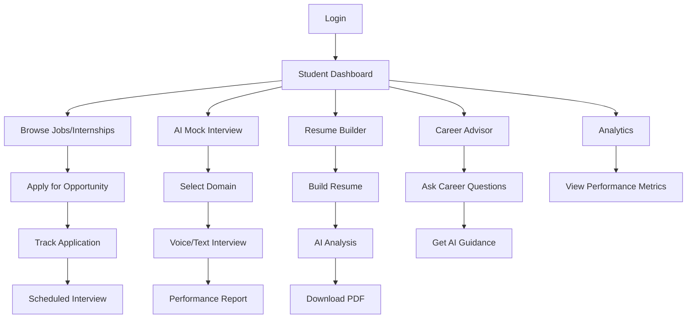
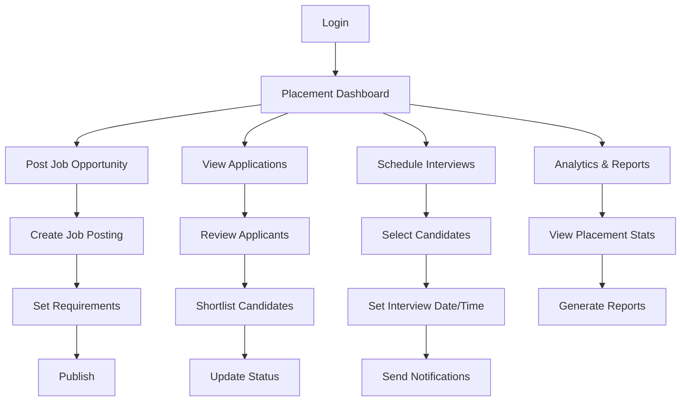
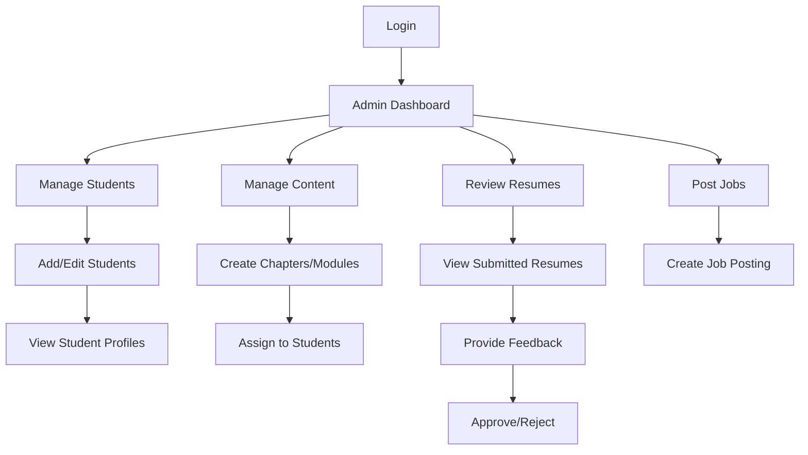

# LAKSHYA - GMU Placement Portal
## Comprehensive Project Documentation Report

---

## 📋 Executive Summary

**LAKSHYA** is a comprehensive, AI-powered placement and internship management portal designed for GM University. The system integrates advanced AI capabilities with traditional placement management to provide students, faculty, placement officers, and internship coordinators with a unified platform for career development and recruitment management.

### Key Highlights
- **AI-Powered Features**: Mock interviews, resume analysis, career guidance chatbot
- **Multi-Role System**: Student, Faculty, Placement Cell, Internship Cell
- **Comprehensive Management**: Jobs, internships, applications, interviews, analytics
- **Modern Tech Stack**: PHP, MySQL, JavaScript, Google Gemini AI

---

## 🏗️ System Architecture

### Technology Stack

#### Backend
- **Language**: PHP 7.4+
- **Database**: MySQL (via PDO with MySQLi wrapper for compatibility)
- **Session Management**: PHP Sessions with role-based access control
- **API Integration**: Google Gemini AI, OpenAI (optional)

#### Frontend
- **HTML5/CSS3**: Modern, responsive design
- **JavaScript**: Vanilla JS with ES6+ features
- **UI Framework**: Custom CSS with Google Fonts (Inter)
- **Icons**: Font Awesome 6.0

#### External Services
- **AI Services**: Google Gemini AI for interviews and resume analysis
- **Email**: SMTP (Gmail) for notifications
- **Speech**: Web Speech API for voice interviews

### Directory Structure

```
placement/
├── admin/                    # Faculty/Admin dashboard and management
├── api/                      # REST API endpoints for AI features
├── assets/                   # Static assets (images, fonts)
├── css/                      # Global stylesheets
├── database/                 # Database setup scripts
├── includes/                 # Shared PHP includes and utilities
├── internship_dashboard/     # Internship cell management
├── js/                       # JavaScript files
├── partials/                 # Reusable UI components
├── placement_manager/        # Placement cell management
├── student/                  # Student portal and features
├── uploads/                  # User-uploaded files
├── config.php               # Main configuration file
├── index.php                # Landing page
└── login.php                # Authentication entry point
```

---

## 🗄️ Database Architecture

### Core Tables

#### 1. **users**
Primary authentication and user management table.

```sql
CREATE TABLE users (
    id INT(11) PRIMARY KEY AUTO_INCREMENT,
    username VARCHAR(50) UNIQUE NOT NULL,
    password_hash VARCHAR(255) NOT NULL,
    role VARCHAR(20) NOT NULL DEFAULT 'student',
    email VARCHAR(100),
    full_name VARCHAR(100),
    created_at DATETIME DEFAULT CURRENT_TIMESTAMP,
    updated_at DATETIME DEFAULT CURRENT_TIMESTAMP ON UPDATE CURRENT_TIMESTAMP
);
```

**Roles**: `student`, `admin`, `placement_officer`, `internship_officer`

#### 2. **job_opportunities**
Stores job postings from companies.

```sql
CREATE TABLE job_opportunities (
    id INT PRIMARY KEY AUTO_INCREMENT,
    company_name VARCHAR(255) NOT NULL,
    job_title VARCHAR(255) NOT NULL,
    description TEXT,
    requirements TEXT,
    location VARCHAR(255),
    salary_range VARCHAR(100),
    job_type VARCHAR(50),
    posted_date DATETIME DEFAULT CURRENT_TIMESTAMP,
    deadline DATETIME,
    status VARCHAR(20) DEFAULT 'active'
);
```

#### 3. **job_applications**
Tracks student applications to jobs.

```sql
CREATE TABLE job_applications (
    id INT PRIMARY KEY AUTO_INCREMENT,
    job_id INT,
    student_id INT,
    status VARCHAR(50) DEFAULT 'pending',
    applied_date DATETIME DEFAULT CURRENT_TIMESTAMP,
    resume_path VARCHAR(255),
    cover_letter TEXT,
    FOREIGN KEY (job_id) REFERENCES job_opportunities(id),
    FOREIGN KEY (student_id) REFERENCES users(id)
);
```

#### 4. **internship_opportunities**
Similar to job_opportunities but for internships.

```sql
CREATE TABLE internship_opportunities (
    id INT PRIMARY KEY AUTO_INCREMENT,
    company_name VARCHAR(255) NOT NULL,
    internship_title VARCHAR(255) NOT NULL,
    description TEXT,
    duration VARCHAR(100),
    stipend VARCHAR(100),
    location VARCHAR(255),
    posted_date DATETIME DEFAULT CURRENT_TIMESTAMP,
    deadline DATETIME,
    status VARCHAR(20) DEFAULT 'active'
);
```

#### 5. **interviews**
Manages interview scheduling and results.

```sql
CREATE TABLE interviews (
    id INT PRIMARY KEY AUTO_INCREMENT,
    job_id INT,
    student_id INT,
    interview_date DATETIME,
    interview_type VARCHAR(50),
    status VARCHAR(50) DEFAULT 'scheduled',
    feedback TEXT,
    score INT,
    FOREIGN KEY (job_id) REFERENCES job_opportunities(id),
    FOREIGN KEY (student_id) REFERENCES users(id)
);
```

#### 6. **student_additional_info**
Extended student profile information.

```sql
CREATE TABLE student_additional_info (
    id INT PRIMARY KEY AUTO_INCREMENT,
    user_id INT UNIQUE,
    phone VARCHAR(20),
    address TEXT,
    date_of_birth DATE,
    gender VARCHAR(10),
    course VARCHAR(100),
    year INT,
    cgpa DECIMAL(3,2),
    skills TEXT,
    bio TEXT,
    linkedin_url VARCHAR(255),
    github_url VARCHAR(255),
    portfolio_url VARCHAR(255),
    FOREIGN KEY (user_id) REFERENCES users(id)
);
```

#### 7. **student_projects**
Student project portfolio.

```sql
CREATE TABLE student_projects (
    id INT PRIMARY KEY AUTO_INCREMENT,
    user_id INT,
    project_title VARCHAR(255),
    description TEXT,
    technologies_used TEXT,
    project_url VARCHAR(255),
    github_url VARCHAR(255),
    start_date DATE,
    end_date DATE,
    FOREIGN KEY (user_id) REFERENCES users(id)
);
```

#### 8. **chapters & modules**
Learning content management.

```sql
CREATE TABLE chapters (
    id INT PRIMARY KEY AUTO_INCREMENT,
    title VARCHAR(255) NOT NULL,
    description TEXT,
    content TEXT,
    created_at DATETIME DEFAULT CURRENT_TIMESTAMP
);

CREATE TABLE modules (
    id INT PRIMARY KEY AUTO_INCREMENT,
    title VARCHAR(255) NOT NULL,
    description TEXT,
    video_url VARCHAR(255),
    pdf_url VARCHAR(255),
    created_at DATETIME DEFAULT CURRENT_TIMESTAMP
);
```

#### 9. **interview_domains**
AI interview domain configuration.

```sql
CREATE TABLE interview_domains (
    id INT PRIMARY KEY AUTO_INCREMENT,
    domain_name VARCHAR(100) NOT NULL,
    icon VARCHAR(50),
    difficulty_level VARCHAR(20),
    is_active BOOLEAN DEFAULT 1
);
```

#### 10. **final_mock_interview_results**
Stores AI interview performance data.

```sql
CREATE TABLE final_mock_interview_results (
    id INT PRIMARY KEY AUTO_INCREMENT,
    user_id INT,
    domain VARCHAR(100),
    overall_score INT,
    communication_score INT,
    technical_score INT,
    confidence_score INT,
    transcript TEXT,
    feedback TEXT,
    created_at DATETIME DEFAULT CURRENT_TIMESTAMP,
    FOREIGN KEY (user_id) REFERENCES users(id)
);
```

### Additional Tables
- `faqs` - Frequently asked questions
- `admin_golden_points` - Important announcements
- `events` - Calendar events
- `student_achievements` - Awards and certifications
- `student_interests` - Student interests and preferences
- `generated_resumes` - AI-generated resume data
- `placement_broadcasts` - Communication hub messages
- `interview_attendance` - Interview attendance tracking
- `saved_jobs` / `saved_internships` - Bookmarked opportunities

---

## 👥 User Roles & Authentication

### Authentication Flow

1. **Login Process** (`login.php`)
   - User enters username and password
   - Credentials validated against `users` table
   - Password verified using `password_verify()` (bcrypt hashing)
   - Session created with `user_id`, `username`, and `role`
   - Redirected to role-specific dashboard

2. **Session Management** (`config.php`)
   - Sessions started automatically via `config.php`
   - Helper functions: `require_login()`, `require_role()`, `is_logged_in()`
   - Role-based access control enforced on all protected pages

### User Roles

#### 1. **Student** (`role: 'student'`)
**Dashboard**: `student/profile.php`

**Capabilities**:
- View and apply for job opportunities
- View and apply for internships
- Build and manage resume
- Take AI-powered mock interviews
- Access career advisor chatbot
- View analytics and performance metrics
- Manage profile and projects
- Track application status
- Schedule and attend interviews
- Access learning modules and quizzes

#### 2. **Faculty/Admin** (`role: 'admin'`)
**Dashboard**: `admin/index.php` or `admin/faculty_dashboard.php`

**Capabilities**:
- Manage students (add, edit, view)
- Create and manage learning content (chapters, modules)
- Post job opportunities
- Review student resumes
- Manage FAQs and golden points
- View student analytics
- Provide feedback to students
- Manage interview domains
- Access AI chatbot for assistance

#### 3. **Placement Officer** (`role: 'placement_officer'`)
**Dashboard**: `placement_manager/index.php`

**Capabilities**:
- Post and manage job opportunities
- View all job applications
- Schedule interviews
- Track placement statistics
- Manage placement drives
- View student profiles and resumes
- Generate placement reports
- Communication hub for broadcasts
- AI insights for placement trends

#### 4. **Internship Officer** (`role: 'internship_officer'`)
**Dashboard**: `internship_dashboard/index.php`

**Capabilities**:
- Post and manage internship opportunities
- View internship applications
- Schedule internship interviews
- Track internship placements
- Manage internship attendance
- View student profiles
- Generate internship reports

---

## 🎯 Core Features

### 1. **Job & Internship Management**

#### For Students
- **Browse Opportunities** (`student/job_opportunities.php`, `student/internship_opportunities.php`)
  - Search and filter by company, location, type
  - View detailed job/internship descriptions
  - Save opportunities for later
  - One-click application with resume

- **Application Tracking** (`student/profile.php`)
  - View all submitted applications
  - Track application status (pending, shortlisted, rejected, accepted)
  - Receive notifications on status changes

#### For Placement/Internship Officers
- **Post Opportunities** (`placement_manager/add_job_posting.php`, `internship_dashboard/add_internship_posting.php`)
  - Create detailed job/internship postings
  - Set deadlines and requirements
  - Manage posting status (active/inactive)

- **Manage Applications** (`placement_manager/applications.php`, `placement_manager/track_applications.php`)
  - View all applications for each posting
  - Filter and search applicants
  - Update application status
  - Shortlist candidates

### 2. **AI-Powered Interview System**

#### AI Mock Interview (`student/ai_interview.php`)

**Features**:
- **Resume-Based Personalization**: AI analyzes student's academic performance, quiz scores, and learning progress
- **Domain Selection**: Students choose interview domain (Web Development, Data Science, AI/ML, etc.) or custom role
- **Voice Interaction**: Speech-to-text and text-to-speech for realistic interview experience
- **Real-time Feedback**: AI provides immediate feedback on answers
- **Performance Scoring**: Evaluates communication, technical knowledge, and confidence

**Technical Implementation**:
```javascript
// Resume data passed to AI for context
const resumeData = {
    name: 'Student Name',
    performance_level: 'Excellent',
    avg_score: 85.5,
    total_quizzes: 10,
    recent_topics: ['Web Development', 'Database Management']
};

// AI Interview API call
fetch('/api/ai_interview_api.php', {
    method: 'POST',
    headers: { 'Content-Type': 'application/json' },
    body: JSON.stringify({
        message: userAnswer,
        domain: selectedDomain,
        resume: resumeData,
        history: chatHistory
    })
});
```

**Performance Report**:
- Overall score (0-100)
- Communication score
- Technical score
- Confidence score
- Detailed transcript
- Strengths and weaknesses
- Improvement suggestions
- Downloadable/printable PDF

#### Interview Rounds (`student/interview_rounds.php`)
- **AI Aptitude Round**: Logical reasoning and quantitative aptitude
- **Technical Coding Round**: Programming challenges
- **HR Interview Round**: Behavioral questions
- **Final Mock Interview**: Comprehensive assessment

### 3. **Resume Builder & Analysis**

#### Resume Builder (`student/resume_builder.php`)
- **Interactive Form**: Step-by-step resume creation
- **Multiple Templates**: Professional resume layouts
- **AI Suggestions**: Smart recommendations for content
- **PDF Export**: Download professional PDF resume
- **Save & Edit**: Store multiple resume versions

#### AI Resume Analyzer (`api/ai_resume_analyzer.php`)
- **Automated Scoring**: 0-100 quality score
- **Strengths Identification**: Highlights strong points
- **Weakness Detection**: Identifies areas for improvement
- **Actionable Suggestions**: Specific recommendations
- **Job Matching**: Optional job description matching

**API Endpoint**:
```
POST /api/resume_analysis.php
Content-Type: application/json

{
    "resume_text": "Resume content...",
    "job_description": "Optional job description"
}
```

### 4. **Career Advisor Chatbot**

#### AI Career Advisor (`student/career_advisor.php`)
- **Personalized Guidance**: Career path recommendations
- **Skill Assessment**: Identifies skill gaps
- **Learning Resources**: Suggests courses and materials
- **Company Research**: Provides company information
- **Interview Preparation**: Tips and strategies
- **Resume Feedback**: Quick resume reviews

**Technical Stack**:
- Google Gemini AI for natural language processing
- Context-aware conversations
- Student profile integration
- FAQ database integration

### 5. **Analytics & Insights**

#### Student Analytics (`student/analytics.php`)
- **Performance Dashboard**: Visual charts and metrics
- **Quiz Performance**: Scores and trends over time
- **Application Statistics**: Success rates and status
- **Skill Progress**: Learning path completion
- **Interview Performance**: Mock interview scores
- **Comparative Analysis**: Peer benchmarking

#### Placement Analytics (`placement_manager/ai_insights.php`)
- **Placement Statistics**: Overall placement rates
- **Company Insights**: Top recruiters and trends
- **Student Performance**: Aggregate metrics
- **Application Trends**: Time-series analysis
- **Success Predictions**: AI-powered forecasting

### 6. **Learning Management**

#### Content Management (`admin/manage_content.php`)
- **Chapters**: Text-based learning content
- **Modules**: Video and PDF resources
- **Assignments**: Student assignments tracking
- **Quizzes**: Assessment and evaluation

#### Language Modules (`student/language_modules.php`)
- **Programming Languages**: Python, Java, JavaScript, etc.
- **Interactive Quizzes**: Skill-based assessments
- **Progress Tracking**: Completion status
- **Certificates**: Achievement recognition

### 7. **Communication Hub**

#### Placement Broadcasts (`placement_manager/communication_hub.php`)
- **Announcements**: Important updates
- **Targeted Messages**: Role-specific communications
- **Event Notifications**: Interview schedules, deadlines
- **Email Integration**: Automated email notifications

### 8. **Calendar & Events**

#### Student Calendar (`student/calendar.php`)
- **Interview Schedules**: Upcoming interviews
- **Application Deadlines**: Job/internship deadlines
- **Personal Events**: Custom event creation
- **Reminders**: Automated notifications
- **Integration**: Sync with external calendars

### 9. **Company Intelligence**

#### Company Research (`student/company_details.php`)
- **Company Profiles**: Detailed company information
- **Interview Questions**: Past interview questions database
- **Hiring Trends**: Historical hiring data
- **Employee Reviews**: Insights from current employees
- **AI-Powered Search**: Intelligent company discovery

**API**: `api/company_intelligence_api.php`, `api/search_companies_api.php`

---

## 🤖 AI Features Deep Dive

### AI Interview System

#### Architecture
```
Student Input (Voice/Text)
    ↓
Speech-to-Text (Web Speech API)
    ↓
AI Interview API (ai_interview_api.php)
    ↓
Google Gemini AI Processing
    ↓
Contextual Response Generation
    ↓
Text-to-Speech (Web Speech Synthesis)
    ↓
Student Hears Response
```

#### Key Components

1. **Resume Context Integration**
   - Student performance data
   - Quiz scores and topics studied
   - Skill level assessment
   - Recent learning activities

2. **Domain-Specific Questioning**
   - Predefined domains (Web Dev, AI/ML, Data Science, etc.)
   - Custom domain support
   - Difficulty adaptation based on performance

3. **Conversation Management**
   - Chat history tracking
   - Context preservation across questions
   - Natural conversation flow
   - Follow-up question generation

4. **Performance Evaluation**
   - Real-time answer analysis
   - Multi-dimensional scoring (communication, technical, confidence)
   - Strengths and weaknesses identification
   - Improvement recommendations

5. **Report Generation**
   - Comprehensive performance report
   - Detailed transcript
   - Visual score presentation
   - Downloadable PDF format

### AI Resume Analysis

#### Analysis Criteria
- **Formatting**: Structure, readability, ATS compatibility
- **Content Quality**: Clarity, relevance, impact
- **Skills Presentation**: Technical and soft skills
- **Experience Description**: Achievements, quantifiable results
- **Education**: Relevance and presentation
- **Keywords**: Industry-specific terminology

#### Output Format
```json
{
    "score": 85,
    "strengths": [
        "Clear professional formatting",
        "Strong technical skills section",
        "Quantifiable achievements"
    ],
    "weaknesses": [
        "Missing soft skills",
        "Limited project descriptions"
    ],
    "suggestions": [
        "Add leadership experience",
        "Include specific metrics",
        "Expand project details"
    ],
    "recommendation": "Approve with minor improvements"
}
```

### AI Career Advisor

#### Capabilities
- **Career Path Guidance**: Personalized recommendations based on skills and interests
- **Skill Gap Analysis**: Identifies missing skills for target roles
- **Learning Recommendations**: Suggests courses, certifications, resources
- **Company Research**: Provides insights on companies and roles
- **Interview Preparation**: Tips, strategies, common questions
- **Resume Feedback**: Quick analysis and suggestions

#### Context Awareness
- Student profile and academic performance
- Previous conversations and queries
- Current job market trends
- University curriculum and resources

---

## 🔧 Technical Implementation

### Configuration (`config.php`)

#### Database Connection
```php
// PDO connection with MySQLi wrapper for compatibility
$pdo = new PDO(
    "mysql:host=localhost;port=3306;dbname=placement_portal;charset=utf8mb4",
    "root",
    "",
    [
        PDO::ATTR_ERRMODE => PDO::ERRMODE_EXCEPTION,
        PDO::ATTR_DEFAULT_FETCH_MODE => PDO::FETCH_ASSOC,
        PDO::ATTR_EMULATE_PREPARES => false,
        PDO::ATTR_TIMEOUT => 5
    ]
);

$mysqli = new MySQLiWrapper($pdo);
```

#### Session Management
```php
// Auto-start sessions
if (session_status() === PHP_SESSION_NONE) {
    session_start();
}

// Helper functions
function require_login() {
    if (!isset($_SESSION['user_id'])) {
        header('Location: login.php');
        exit;
    }
}

function require_role($role) {
    if (!isset($_SESSION['role']) || $_SESSION['role'] !== $role) {
        header('Location: login.php');
        exit;
    }
}
```

### API Endpoints

#### 1. **AI Interview API** (`api/ai_interview_api.php`)
- **Method**: POST
- **Input**: User message, domain, resume data, chat history
- **Output**: AI response, interview questions, feedback
- **AI Model**: Google Gemini AI

#### 2. **Resume Analysis API** (`api/resume_analysis.php`)
- **Method**: POST
- **Input**: Resume text, optional job description
- **Output**: Score, strengths, weaknesses, suggestions
- **AI Model**: Google Gemini AI

#### 3. **Career Advisor API** (`api/chat_api.php`)
- **Method**: POST
- **Input**: User query, conversation history
- **Output**: AI-generated career advice
- **AI Model**: Google Gemini AI

#### 4. **Quiz API** (`api/quiz_api.php`, `api/skill_based_quiz_api.php`)
- **Method**: POST
- **Input**: Quiz type, difficulty, topic
- **Output**: Generated quiz questions
- **AI Model**: Google Gemini AI

#### 5. **Company Intelligence API** (`api/company_intelligence_api.php`)
- **Method**: POST
- **Input**: Company name or search query
- **Output**: Company details, interview questions, insights
- **AI Model**: Google Gemini AI

#### 6. **Analytics API** (`api/analytics_api.php`)
- **Method**: GET
- **Input**: Student ID, date range
- **Output**: Performance metrics, charts data
- **Processing**: Server-side aggregation

### Frontend Architecture

#### Design System
- **Color Palette**: Maroon (#5b1f1f) and Gold (#ebd08d) - University branding
- **Typography**: Inter font family
- **Components**: Reusable cards, modals, forms
- **Responsive**: Mobile-first design approach

#### JavaScript Features
- **Speech Recognition**: Web Speech API for voice input
- **Speech Synthesis**: Text-to-speech for AI responses
- **Fetch API**: Asynchronous API calls
- **Chart.js**: Analytics visualizations
- **PDF Generation**: Client-side PDF export

### Security Measures

1. **Password Security**
   - Bcrypt hashing (`password_hash()`, `password_verify()`)
   - Minimum complexity requirements

2. **SQL Injection Prevention**
   - Prepared statements for all database queries
   - Input sanitization

3. **XSS Protection**
   - `htmlspecialchars()` for output escaping
   - Content Security Policy headers

4. **CSRF Protection**
   - Session-based validation
   - Token verification for sensitive actions

5. **Access Control**
   - Role-based permissions
   - Session validation on every request

---

## 📊 User Workflows

### Student Journey



### Placement Officer Journey



### Faculty/Admin Journey



---

## 🚀 Deployment & Setup

### Prerequisites
- **Web Server**: Apache (XAMPP/WAMP) or Nginx
- **PHP**: Version 7.4 or higher
- **MySQL**: Version 5.7 or higher
- **Extensions**: PDO, MySQLi, cURL, JSON

### Installation Steps

1. **Clone/Download Project**
   ```bash
   git clone <repository-url>
   cd placement
   ```

2. **Configure Database**
   - Create database: `placement_portal`
   - Update `config.php` with database credentials
   - Run setup scripts in `database/` folder

3. **Set Up Tables**
   - Visit `database/create_users_table.php` to create users table
   - Default admin credentials: `admin` / `admin`
   - Other tables are auto-created on first use

4. **Configure API Keys**
   - Set Google Gemini API key in environment or `openai_config.php`
   - Configure SMTP settings in `config.php` for email notifications

5. **Set Permissions**
   - Make `uploads/` directory writable (755 or 777)
   - Ensure proper file permissions for PHP execution

6. **Access Application**
   - Navigate to `http://localhost/placement/`
   - Login with default admin credentials
   - Change admin password immediately

### Environment Variables
```
GMU_HOST=localhost
GMU_USERNAME=root
GMU_PASSWORD=
GMU_DB=placement_portal
GMU_PORT=3306
GEMINI_API_KEY=your_api_key_here
```

---

## 📈 Future Enhancements

### Planned Features
- [ ] Mobile application (Android/iOS)
- [ ] Advanced analytics with machine learning
- [ ] Integration with LinkedIn for profile import
- [ ] Video interview capabilities
- [ ] Automated resume parsing from PDF/DOCX
- [ ] Multi-language support
- [ ] Advanced notification system (push notifications)
- [ ] Integration with external job boards
- [ ] Blockchain-based certificate verification
- [ ] Alumni network integration

### Technical Improvements
- [ ] Migration to modern PHP framework (Laravel/Symfony)
- [ ] RESTful API architecture
- [ ] Frontend framework (React/Vue.js)
- [ ] Microservices architecture
- [ ] Docker containerization
- [ ] CI/CD pipeline
- [ ] Comprehensive unit and integration tests
- [ ] Performance optimization and caching
- [ ] Enhanced security measures (2FA, OAuth)

---

## 📞 Support & Maintenance

### Key Files for Troubleshooting

- **Database Issues**: `config.php`, `database/create_users_table.php`
- **Authentication Problems**: `login.php`, `includes/auth_service.php`
- **AI Features Not Working**: `api/ai_proxy.php`, `openai_config.php`
- **Email Issues**: `config.php` (SMTP settings)

### Common Issues

1. **Database Connection Failed**
   - Check MySQL service is running
   - Verify credentials in `config.php`
   - Ensure database `placement_portal` exists

2. **AI Features Not Working**
   - Verify Google Gemini API key is set
   - Check API endpoint accessibility
   - Review browser console for errors

3. **Login Issues**
   - Clear browser cache and cookies
   - Verify users table exists
   - Check password hash in database

4. **File Upload Errors**
   - Check `uploads/` directory permissions
   - Verify PHP upload limits in `php.ini`
   - Ensure sufficient disk space

---

## 📝 Conclusion

The **LAKSHYA GMU Placement Portal** is a comprehensive, modern solution for managing campus placements and internships. By integrating AI-powered features with traditional placement management, it provides students with personalized career guidance, realistic interview practice, and professional development tools, while giving administrators powerful tools for managing the entire placement lifecycle.

The system's modular architecture, role-based access control, and extensive feature set make it scalable and adaptable to various educational institutions' needs.

---

**Version**: 1.0  
**Last Updated**: January 2026  
**Developed for**: GM University  
**Project Name**: LAKSHYA - GMU Placement Portal
