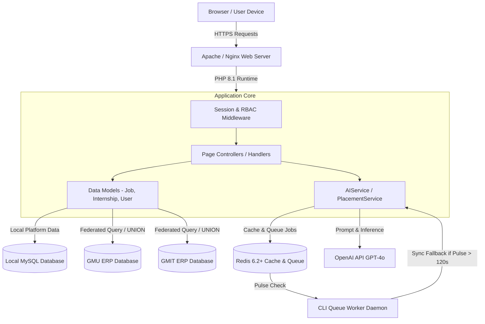
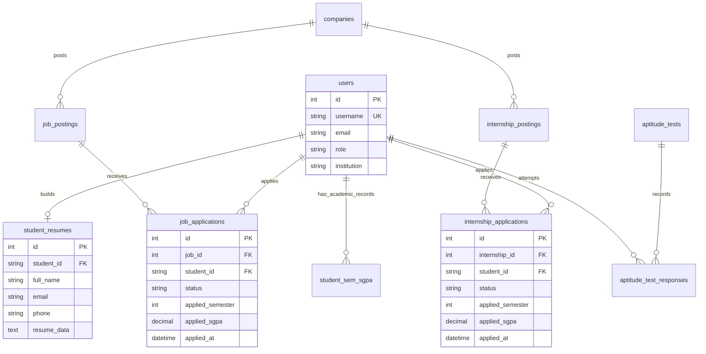

# 🎓 Lakshya — AI-Powered Placement Assessment & Career Preparation Portal

[](https://www.php.net/)
[](https://www.mysql.com/)
[](https://redis.io/)
[](https://openai.com/)
[](#-system-architecture)
[](#-license)

**Lakshya** is the centralized, enterprise-grade placement preparation and assessment ecosystem engineered for **GM University (GMU)** and **GM Institute of Technology (GMIT)**. It orchestrates real-time timed technical coding sandboxes, AI-driven HR situational vivas, quantitative and logical aptitude rounds, an ATS resume parser with automated job-matching feedback, and federated real-time student identity resolution across dual-campus ERP databases.

---

## 📋 Table of Contents

- [01. Overview \& Purpose](#01-overview--purpose)
- [02. Problem Statement \& Motivation](#02-problem-statement--motivation)
- [03. Key Features](#03-key-features)
  - [Functional Features](#functional-features)
  - [Technical Features](#technical-features)
- [04. System Architecture](#04-system-architecture)
- [05. Technology Stack](#05-technology-stack)
- [06. Repository Structure](#06-repository-structure)
- [07. Core Modules Breakdown](#07-core-modules-breakdown)
- [08. Request Lifecycle \& Workflow](#08-request-lifecycle--workflow)
- [09. Database Schema \& Entity Relationships](#09-database-schema--entity-relationships)
- [10. Authentication \& Authorization](#10-authentication--authorization)
- [11. AI / LLM Pipeline \& Prompt Strategy](#11-ai--llm-pipeline--prompt-strategy)
- [12. Background Queue \& Worker Architecture](#12-background-queue--worker-architecture)
- [13. Security Implementation](#13-security-implementation)
- [14. Performance Optimizations](#14-performance-optimizations)
- [15. API \& Endpoint Documentation](#15-api--endpoint-documentation)
- [16. Configuration \& Environment Variables](#16-configuration--environment-variables)
- [17. Installation \& Setup Guide](#17-installation--setup-guide)
- [18. Production Deployment Guide](#18-production-deployment-guide)
- [19. Verification \& Testing](#19-verification--testing)
- [20. Troubleshooting \& FAQ](#20-troubleshooting--faq)
- [21. Architectural Rationale \& Design Decisions](#21-architectural-rationale--design-decisions)
- [22. Scalability \& Roadmap](#22-scalability--roadmap)
- [23. License \& Acknowledgements](#23-license--acknowledgements)

---

## 01. Overview & Purpose

Placement drives at university campuses involve thousands of engineering and management students competing across multiple recruitment stages: online aptitude assessments, technical coding rounds, situational HR vivas, and resume shortlisting.

**Lakshya** centralizes all placement preparation, mock assessment, and active recruitment drives into a single unified web platform. It serves **students**, **placement officers**, **internship coordinators**, **heads of departments (HODs)**, and **university executive leadership (Vice Chancellor)**.

```
                  +-------------------------------------------------------+
                  |                  LAKSHYA GATEWAY                      |
                  +-------------------------------------------------------+
                                      |
         +----------------------------+----------------------------+
         |                                                         |
  [ GMU Campus ERP ]                                       [ GMIT Campus ERP ]
  • ad_student_details                                     • ad_student_details
  • ad_student_approved                                    • student_sem_sgpa
  • gmu_users                                              • gmit_users
         |                                                         |
         +----------------------------+----------------------------+
                                      |
                   +------------------------------------+
                   |     Unified Identity Resolver      |
                   +------------------------------------+
```

---

## 02. Problem Statement & Motivation

Prior to Lakshya, placement operations across GMU and GMIT suffered from structural operational bottlenecks:

1. **Fragmented Third-Party Testing Services**: Universities paid heavy annual licensing fees for external assessment vendors that lacked customization, provided delayed feedback, and offered no real-time AI mock viva practice.
2. **Excel-Based Tracking Chaos**: Placement officers tracked job applications, student eligibility, and semester SGPAs across hundreds of disconnected Excel spreadsheets, leading to data inconsistency and missed application deadlines.
3. **Federated Dual-Campus Identity Mismatch**: GMU and GMIT operate separate academic ERP databases (`gmu_ad_student_approved`, `gmit_ad_student_details`). Students (especially diploma lateral-entry students) often existed in academic result tables without having accounts in legacy web user tables (`gmu_users`), causing profile resolution crashes (`Unknown / N/A`).
4. **Unreliable Background Queues**: Background AI processing workers occasionally died or leaked memory, leaving students staring at indefinite "Thinking..." loading spinners during active test drives.

**Lakshya** solves these issues through a custom **Decoupled Monolith Architecture** built on PHP 8, Redis Queue Pulse Monitoring, OpenAI API orchestration, and a Key-Union ERP Identity Resolver.

---

## 03. Key Features

### Functional Features

* **⚡ Timed Technical Coding Sandboxes**: Interactive multi-language code editor (CodeMirror) with test-case validation, instant execution, and proctored time limits.
* **🧮 AI-Graded Aptitude Engine**: Quantitative, logical, and verbal reasoning rounds featuring LaTeX mathematical formula rendering (KaTeX) and automated answer normalization.
* **🎙️ AI HR Situational Vivas**: Interactive conversational interviews using the Web Speech API (speech-to-text input and voice synthesis output) with real-time AI evaluation criteria (communication, technical confidence, problem-solving).
* **📄 ATS Resume Builder & AI Scanner**: Multi-template resume generator with an automated ATS parser that evaluates resumes against specific Job Descriptions (JDs) to output score deductions, keyword gaps, and bullet-point rewrites.
* **💼 Placement & Internship Drive Gateway**: Complete application lifecycle management with strict eligibility filtering (SGPA cutoffs, SSLC/PUC percentages, active backlogs) and frozen academic snapshotting upon application submission.
* **📊 Placement Officer Intelligence Hub**: Centralized reporting analytics, multi-criteria student filtering, SGPA trend modal analysis, and single-click Excel exports containing cryptographically signed resume viewing links.

### Technical Features

* **🛡️ Key-Union ERP Identity Resolver**: Resolves student profile metadata across 5 multi-institution tables using SQL `UNION` subqueries (`k.student_key`), guaranteeing 100% resolution for lateral-entry and newly admitted students.
* **💓 Worker Pulse Guard (`ai_workers_pulse`)**: Real-time heartbeat checking in Redis. If background workers do not pulse within 120 seconds, web handlers automatically fall back to synchronous execution to eliminate dangling queue states.
* **🔑 Cryptographic Signed Resume Viewer (`&token=...`)**: Solves browser session cookie isolation in external software (Microsoft Excel/CSV hyperlinks) by validating 16-character HMAC token signatures (`generateResumeToken()`) for direct PDF streaming.
* **🧩 MCQ Answer Choice Normalization**: Normalizes string answer representations (`"Option B"`, `"B"`, `"1"`) into integer indices (`0`–`3`) to eliminate AI self-contradiction bugs during grading.
* **⏳ Multi-Layer Deadline Enforcement**: Enforces application closing deadlines at the UI (button hiding), Controller (POST request rejection), and Database Model (`apply()`) layers.

---

## 04. System Architecture



---

## 05. Technology Stack

| Layer | Technology | Version | Purpose / Role |
| :--- | :--- | :--- | :--- |
| **Backend Core** | PHP | 8.1+ | Primary application runtime, business logic, and MVC routing. |
| **Database** | MySQL / MariaDB | 8.0+ | Relational storage for application data and remote ERP federated queries. |
| **In-Memory Cache & Queue** | Redis | 6.2+ | Session storage, response caching, worker pulse monitoring, and job queue. |
| **AI / LLM Engine** | OpenAI API | GPT-4o / GPT-3.5 | Real-time viva feedback, ATS scoring, and prompt inference. |
| **Code Sandbox** | CodeMirror | 5.65+ | In-browser code editing, syntax highlighting, and test execution UI. |
| **Math Rendering** | KaTeX | 0.16+ | Fast client-side LaTeX math rendering for aptitude questions. |
| **Speech Processing** | Web Speech API | Native ES6 | Browser-native SpeechRecognition and SpeechSynthesis for HR vivas. |
| **Styling & UI** | Vanilla CSS3 | Standard | Custom CSS tokens, glassmorphism, responsive grid layout, and dark mode. |
| **Icons & Fonts** | FontAwesome / Google Fonts | 6.4 / Outfit, Inter | UI typography and modern icons. |

---

## 06. Repository Structure

```
Lakshya/
├── config/                        # Platform configuration & bootstrap
│   ├── bootstrap.php              # Global initialization, autoloader, and error handlers
│   ├── constants.php              # App-wide constants, roles, institutions, and directory paths
│   ├── database.php               # PDO database connection manager (Local + GMU/GMIT ERPs)
│   └── session.php                # Session management, authentication checks, & RBAC rules
├── database/                      # Migrations, schemas, and seed files
│   ├── schema.sql                 # Complete database schema definition
│   ├── seed_data.sql              # Initial system seed data and admin accounts
│   └── migrations/                # Database migrations for schema updates
├── public/                        # Publicly accessible web root
│   ├── .htaccess                  # Apache rewrite rules and static directory protection
│   ├── index.php                  # Landing page & authentication gateway
│   ├── admin/                     # System Administrator dashboard & user management
│   ├── coordinator/               # Department Coordinator reporting & student monitoring
│   ├── hod/                       # Head of Department dashboard & performance analytics
│   ├── internship_officer/        # Internship Officer drive & candidate management
│   │   ├── applications.php       # Candidate listing & Excel export with signed tokens
│   │   ├── dashboard.php          # Internship drive performance metrics
│   │   └── internship_placed.php  # Placed student record management
│   ├── officer/                   # Placement Officer drive & candidate management
│   │   ├── applications.php       # Job candidate listing & SGPA trend analysis
│   │   ├── job_applicants.php     # Company-wise applicant management
│   │   └── reports.php            # Intelligence Hub (Details, Portfolio, AI Reports, Stats)
│   ├── student/                   # Student candidate portal
│   │   ├── ai_aptitude_test.php   # Timed aptitude test interface with KaTeX rendering
│   │   ├── internship_details.php # Internship details & application submission (Deadline guarded)
│   │   ├── job_details.php        # Job details & strict eligibility application handler
│   │   ├── resume_builder.php     # Multi-step resume generator
│   │   ├── resume_analyzer.php    # AI ATS resume scanner & scoring engine
│   │   └── view_resume.php        # Secure PHP proxy resume viewer (Session + Signed Token)
│   └── assets/                    # CSS, JS, images, and static vendor assets
├── src/                           # Backend application source code
│   ├── Helpers/                   # Utility helpers
│   │   ├── functions.php          # Global helper functions (clean(), generateResumeToken(), etc.)
│   │   └── SessionFilterHelper.php# Filter state persistence helper
│   ├── Models/                    # Data models (Active Record / Repository Pattern)
│   │   ├── Admin.php              # System administration model
│   │   ├── AIService.php          # OpenAI API wrapper, prompt builder, & answer normalizer
│   │   ├── Internship.php         # Internship posting model
│   │   ├── InternshipApplication.php # Internship application model & ERP identity enricher
│   │   ├── JobApplication.php     # Job application model & ERP identity enricher
│   │   ├── JobPosting.php         # Job posting model
│   │   ├── PlacementOfficer.php   # Officer reporting & paged student query engine
│   │   ├── Resume.php             # Resume model
│   │   └── User.php               # Unified user & dual-ERP identity model
│   └── Services/                  # Business logic services
│       ├── AIService.php          # Core AI inference pipeline
│       └── StudentIntelligenceService.php # Performance analytics service
├── storage/                       # Storage directory
│   ├── cache/                     # Transient cache files
│   └── logs/                      # Application error and system logs
└── README.md                      # Comprehensive project documentation
```

---

## 07. Core Modules Breakdown

### 1. Dual-Campus ERP Student Identity Resolver
Resolves student profiles across GMU and GMIT federated databases. Uses a 5-way SQL `UNION` subquery pattern over `ad_student_details`, `ad_student_approved`, and `users` tables to construct unified profile objects (Full Name, Branch, Course, Semester, SGPA, Email, Phone) even when students are missing from legacy web user tables (`gmu_users`).

### 2. Timed Coding Assessment Sandbox
Provides a real-time coding environment using CodeMirror. Features automated test-case evaluation, syntax validation, execution time limits, and tab-switch proctoring detectors.

### 3. AI Aptitude Engine & Answer Normalizer
Renders math-heavy aptitude questions formatted with LaTeX via KaTeX. Employs `AIService::normalizeMCQAnswers()` to sanitize string options (`"Option B"`, `"A"`, `"1"`) into zero-indexed integers (`0`–`3`), preventing evaluation mismatches.

### 4. AI HR Situational Viva & Voice Module
Engages students in voice-based or text-based HR interview scenarios. Uses the browser's Web Speech API for voice input and output, streaming responses via Server-Sent Events (SSE) and scoring candidates on communication, domain logic, and problem-solving.

### 5. ATS Resume Builder & AI Scanner
Generates PDF resumes and parses student uploads using text extraction and OpenAI GPT-4o analysis. Scores resumes against target Job Descriptions to produce actionable feedback, deduction lists, missing keywords, and bullet-point improvements.

### 6. Placement Officer Intelligence Hub (`reports.php`)
Provides placement officers with comprehensive candidate reports across 4 views: **Details**, **Portfolio**, **AI Reports**, and **Statistics**. Enables filtering by campus, branch, semester, SGPA cutoff, and name, with single-click Excel downloads containing signed resume links.

---

## 08. Request Lifecycle & Workflow

```
[User Browser]
      │
      │  1. HTTP GET /student/view_resume.php?usn=U23E01AI031&token=a1b2c3d4e5f6...
      ▼
[config/bootstrap.php]  ──►  Loads Environment, Constants, Autoloader, & PDO DB Manager
      │
      ▼
[public/student/view_resume.php]
      │
      ├─► 2. Token Check: verifyResumeToken('U23E01AI031', 'a1b2c3d4e5f6...')
      │      ├─► Valid Token? ──► Set $canAccess = true
      │      └─► Invalid Token? ─► Check isLoggedIn() & RBAC ($currentRole in $privilegedRoles)
      │
      ├─► 3. Access Authorized ($canAccess == true)
      │
      ├─► 4. File Resolution: Searches storage paths for USN_Resume.pdf variants
      │
      ▼
[HTTP Response Headers]
      │  Content-Type: application/pdf
      │  Content-Disposition: inline; filename="U23E01AI031_Resume.pdf"
      ▼
[Browser PDF Viewer Opens File Inline]
```

---

## 09. Database Schema & Entity Relationships



### Core Schema Tables

* **`app_officers`**: Administrative and officer account credentials (`id`, `username`, `password`, `full_name`, `email`, `role`, `institution`, `is_active`).
* **`users`**: Platform student and user accounts mapped across GMU and GMIT.
* **`student_resumes`**: Centralized student resume records (`student_id`, `full_name`, `email`, `phone`, `education`, `experience`, `projects`, `skills`, `resume_data`).
* **`job_applications`**: Job applications tracking student ID, job ID, status, and frozen academic snapshots (`applied_semester`, `applied_sgpa`).
* **`internship_applications`**: Internship applications tracking candidate ID, internship ID, status, and static SGPA snapshots.
* **`student_sem_sgpa`**: Verified semester-wise academic records for GMIT students.
* **`ai_workers_pulse`**: Redis/MySQL queue worker heartbeat table monitoring active queue consumers.

---

## 10. Authentication & Authorization

Lakshya implements a **Dual-Layer Authorization Architecture**:

### 1. Role-Based Access Control (RBAC)
Session-based authentication managed by `config/session.php` enforcing 8 defined roles:

* `ROLE_STUDENT` (`student`): Candidate access to sandboxes, job applications, and personal resume builder.
* `ROLE_PLACEMENT_OFFICER` (`placement_officer`): Access to job postings, applicant tracking, and placement intelligence reports.
* `ROLE_INTERNSHIP_OFFICER` (`internship_officer`): Access to internship drives, applicant shortlisting, and exports.
* `ROLE_DEPT_COORDINATOR` (`dept_coordinator`): Departmental student progress monitoring.
* `ROLE_HOD` (`hod`): Departmental analytics dashboard access.
* `ROLE_VC` (`vc`): Executive oversight and university-wide analytics.
* `ROLE_ADMIN` (`admin`): Full platform administration and configuration.
* `ROLE_DEMO` (`demo`): Read-only demonstration mode.

### 2. Cryptographic Signed Token Access (`&token=...`)
Direct file viewer links (e.g. `view_resume.php`) use signed HMAC-SHA256 tokens (`generateResumeToken($usn)`). This grants secure access when links are opened from external software like Microsoft Excel, where browser session cookies are absent.

```php
function generateResumeToken($usn) {
    $secret = defined('APP_KEY') ? APP_KEY : 'Lakshya_Secure_Resume_Key_2026';
    return substr(hash_hmac('sha256', strtoupper(trim($usn)), $secret), 0, 16);
}
```

---

## 11. AI / LLM Pipeline & Prompt Strategy

Lakshya uses OpenAI's GPT-4o model via `src/Services/AIService.php` to deliver real-time evaluation across 3 main areas:

```
[Assessment Data / Code / Resume Text / Voice Input]
                       │
                       ▼
         [AIService Prompt Construction]
     • Guidelines & strict schema instructions
     • MCQ normalization (Options -> 0..3 indices)
                       │
                       ▼
          [OpenAI GPT-4o API Inference]
                       │
                       ▼
        [JSON Sanitization & Structure Check]
                       │
                       ▼
   [Live SSE Stream / Database Record Output]
```

* **System Guidelines**: Prompts enforce structured JSON output formats to ensure reliable automated parsing.
* **MCQ Answer Normalization**: `AIService::normalizeMCQAnswers()` strips option prefixes (`"Option A: "`, `"A) "`) and converts them into standardized zero-indexed integers (`0`, `1`, `2`, `3`) before evaluating aptitude responses.
* **Robust Error Handling**: If an API call times out or returns malformed JSON, the service gracefully falls back to structured local evaluation matrices without crashing the UI.

---

## 12. Background Queue & Worker Architecture

To process heavy AI tasks asynchronously, Lakshya uses a Redis-backed queue daemon managed with a health-check guard (`ai_workers_pulse`):

```
                       +-----------------------------+
                       |   Job Enqueued by Handler   |
                       +-----------------------------+
                                      │
                                      ▼
                      +-------------------------------+
                      | Worker Pulse Check (< 120s)?  |
                      +-------------------------------+
                                 /         \
                              YES           NO
                              /               \
                             ▼                 ▼
             +-----------------------+   +------------------------+
             | Process via Redis     |   | Fallback to            |
             | Worker Daemon         |   | Synchronous Execution  |
             +-----------------------+   +------------------------+
```

1. **Worker Pulse Check**: Web producers inspect the `ai_workers_pulse` table before queueing jobs.
2. **Synchronous Fallback**: If no worker has pulsed within **120 seconds**, the web request executes the task synchronously inline to prevent endless loading spinners for students.
3. **Memory Limits & Self-Restart**: Worker daemons monitor memory consumption on each loop iteration and exit cleanly when reaching threshold limits, allowing process managers (Supervisor/systemd) to restart them with fresh memory allocations.

---

## 13. Security Implementation

* **SQL Injection Prevention**: All database queries use PDO prepared statements with bound parameters (`$stmt->execute($params)`).
* **Cross-Site Scripting (XSS) Prevention**: User inputs rendered in views are sanitized using `htmlspecialchars($data, ENT_QUOTES, 'UTF-8')` and `clean()`.
* **Cross-Site Request Forgery (CSRF)**: State-modifying POST forms require valid CSRF tokens (`$_SESSION['csrf_token']`).
* **Path Traversal Guards**: The file proxy ([view_resume.php](file:///c:/htdocs/Lakshya/public/student/view_resume.php)) strips directory traversal sequences (`..`), leading slashes, and restricts access strictly to valid subdirectories within `public/uploads/`.
* **Password Hashing**: User passwords are stored as secure hashes generated using `password_hash($password, PASSWORD_DEFAULT)`.

---

## 14. Performance Optimizations

* **In-Memory Response Caching**: Frequently accessed AI analysis metrics and student department analytics are cached in Redis to minimize database load.
* **Streamed PDF Delivery**: Resumes are served inline using `readfile()` to stream PDF binary data directly to the browser without loading entire files into PHP memory buffers.
* **Chunked CSV Exporting**: Large dataset exports in `reports.php` and `applications.php` use `fputcsv()` memory streaming with UTF-8 BOM headers for compatibility with Microsoft Excel.
* **Database Query Indexing**: Key foreign columns (`student_id`, `usn`, `internship_id`, `job_id`, `created_at`) are indexed to speed up UNION subquery execution times.

---

## 15. API & Endpoint Documentation

### 1. Resume Viewer Proxy
* **Endpoint**: `GET /student/view_resume.php`
* **Parameters**: `usn` (String, Required), `token` (String, Optional for Excel links)
* **Response**: Inline PDF stream (`Content-Type: application/pdf`).

### 2. Student Application Handler
* **Endpoint**: `POST /student/job_details.php` or `/student/internship_details.php`
* **Parameters**: `id` (Integer), `apply` (Submit flag), `csrf_token` (String)
* **Response**: JSON status object or redirect with success/error notification.

### 3. Officer Applications Excel Export
* **Endpoint**: `GET /internship_officer/applications.php?id={ID}&export=excel`
* **Response**: Downloadable UTF-8 CSV spreadsheet with candidate details and signed resume links.

---

## 16. Configuration & Environment Variables

Key settings are configured in `config/constants.php` and `config/database.php`:

```php
// Application Identity & Paths
define('APP_NAME', 'Lakshya');
define('APP_URL', 'http://localhost/Lakshya');
define('ROOT_PATH', dirname(__DIR__));
define('UPLOADS_PATH', ROOT_PATH . '/public/uploads');

// Database Credentials
define('DB_HOST', '127.0.0.1');
define('DB_NAME', 'lakshya');
define('DB_USER', 'root');
define('DB_PASS', '');

// Federated ERP Database Prefixes
define('DB_GMU_PREFIX', 'gmu_');
define('DB_GMIT_PREFIX', 'gmit_');

// OpenAI Credentials & Security Keys
define('OPENAI_API_KEY', 'sk-proj-...');
define('APP_KEY', 'Lakshya_Secure_Production_HMAC_Secret_2026');
```

---

## 17. Installation & Setup Guide

### Prerequisites
* **PHP**: 8.1 or higher with `pdo_mysql`, `curl`, `mbstring`, and `gd` extensions enabled.
* **Database**: MySQL 8.0+ or MariaDB 10.4+.
* **Cache**: Redis 6.2+.
* **Web Server**: Apache 2.4+ (with `mod_rewrite` enabled) or Nginx.

### Local Development Setup

1. **Clone the Repository**:
   ```bash
   git clone https://github.com/your-org/Lakshya.git
   cd Lakshya
   ```

2. **Configure Web Server Directory**:
   Ensure your web server document root points to `c:/htdocs/Lakshya` or configure a virtual host for `/Lakshya/public`.

3. **Set Up Databases**:
   Import the database schema and initial seed data into MySQL:
   ```bash
   mysql -u root -p -e "CREATE DATABASE lakshya;"
   mysql -u root -p lakshya < database/schema.sql
   mysql -u root -p lakshya < database/seed_data.sql
   ```

4. **Start Redis Cache Server**:
   ```bash
   redis-server
   ```

5. **Verify PHP Environment**:
   Run the CLI syntax check across core files:
   ```bash
   php -l config/bootstrap.php
   php -l src/Models/User.php
   ```

6. **Access the Portal**:
   Open your browser and navigate to `http://localhost/Lakshya/public`.

---

## 18. Production Deployment Guide

1. **Web Server Configuration (Apache `.htaccess`)**:
   Verify that `public/.htaccess` is present to handle clean URLs and block unauthorized directory browsing:
   ```apache
   Options -Indexes
   DirectoryIndex index.php

   <IfModule mod_rewrite.c>
       RewriteEngine On
       RewriteBase /Lakshya/
       RewriteRule ^(src|config|database|storage|vendor)/ - [F,L]
       RewriteCond %{REQUEST_FILENAME} !-f
       RewriteCond %{REQUEST_FILENAME} !-d
       RewriteRule ^(.+)$ $1.php [L,QSA]
   </IfModule>
   ```

2. **Configure Background Worker Daemon (Supervisor)**:
   Set up a Supervisor process monitor at `/etc/supervisor/conf.d/lakshya_worker.conf` to run the background job consumer:
   ```ini
   [program:lakshya_worker]
   command=php /var/www/Lakshya/bin/worker.php
   autostart=true
   autorestart=true
   user=www-data
   redirect_stderr=true
   stdout_logfile=/var/www/Lakshya/storage/logs/worker.log
   ```

3. **Set Directory Permissions**:
   ```bash
   chown -R www-data:www-data storage/ public/uploads/
   chmod -R 775 storage/ public/uploads/
   ```

---

## 19. Verification & Testing

Verify system components locally using PHP CLI commands:

```bash
# 1. Test database connections & models
php -r "require_once 'config/bootstrap.php'; echo 'DB Connection: ' . (getDB() ? 'OK' : 'FAIL');"

# 2. Check PHP syntax across Models & Handlers
php -l src/Models/AIService.php
php -l public/student/view_resume.php
php -l public/internship_officer/applications.php

# 3. Test signed token generation logic
php -r "require_once 'config/bootstrap.php'; echo generateResumeToken('U23E01AI031');"
```

---

## 20. Troubleshooting & FAQ

### Q1: Why do Excel resume links show "Access Denied: Please log in"?
**Cause**: Excel opens hyperlinks in an external browser context that does not contain the user's active session cookie.  
**Fix**: Ensure links include signed tokens (`&token=...`). The viewer checks token validity via `verifyResumeToken()` to stream the PDF securely without requiring active session cookies.

### Q2: Why do lateral entry students show "Unknown / N/A" details?
**Cause**: Students exist in academic result tables (`ad_student_approved`) but are absent from legacy user accounts tables (`gmu_users`).  
**Fix**: `enrichWithStudentData()` uses SQL `UNION` subqueries over `ad_student_details`, `ad_student_approved`, and `users` to resolve profile details for all students.

### Q3: Why is KaTeX math not rendering in aptitude tests?
**Cause**: LaTeX expressions in question prompts may lack delimiters.  
**Fix**: Standardize LaTeX expressions with `\(...\)` for inline math and `\[...\]` for display math.

---

## 21. Architectural Rationale & Design Decisions

* **Why a Decoupled Monolith?**: For mid-sized campus operations, microservices add network overhead and operational complexity. A Decoupled Monolith provides high cohesion, simpler database transactions, and fast local execution, with Redis handling async decoupling for heavy AI tasks.
* **Why Synchronous Fallback for Worker Queues?**: Background queues without fallback mechanisms fail silently when workers die. The 120-second pulse check ensures students never get stuck behind dead background workers during live assessments.
* **Why Inline PDF Streaming?**: Downloading raw PDFs litters student/officer local storage and risks unauthorized static file exposure. Inline browser streaming delivers a seamless viewing experience while maintaining strict access control.

---

## 22. Scalability & Roadmap

### Future Enhancements
* 🚀 **Company-Specific Drive Simulators**: Specialized mock exam suites mirroring exact test patterns for TCS NQT, Accenture, Infosys, and Wipro.
* 📱 **PWA Mobile Support**: Service worker integration for offline formula review and test prep on mobile devices.
* 🔔 **WhatsApp & Push Notifications**: Real-time automated WhatsApp alerts for application deadlines, shortlists, and interview schedules.
* 🤝 **Peer-to-Peer Mock Viva Rooms**: Collaborative video practice rooms for peer HR interview preparation with shared scoring rubrics.

---

## 23. License & Acknowledgements

* **Copyright**: © 2026 GM University (GMU) & GM Institute of Technology (GMIT). All rights reserved.
* **Credits**: Engineered by the Lakshya Placement & Career Preparation Development Team. Special thanks to the Placement Cells and Academic IT Departments of GMU and GMIT.
