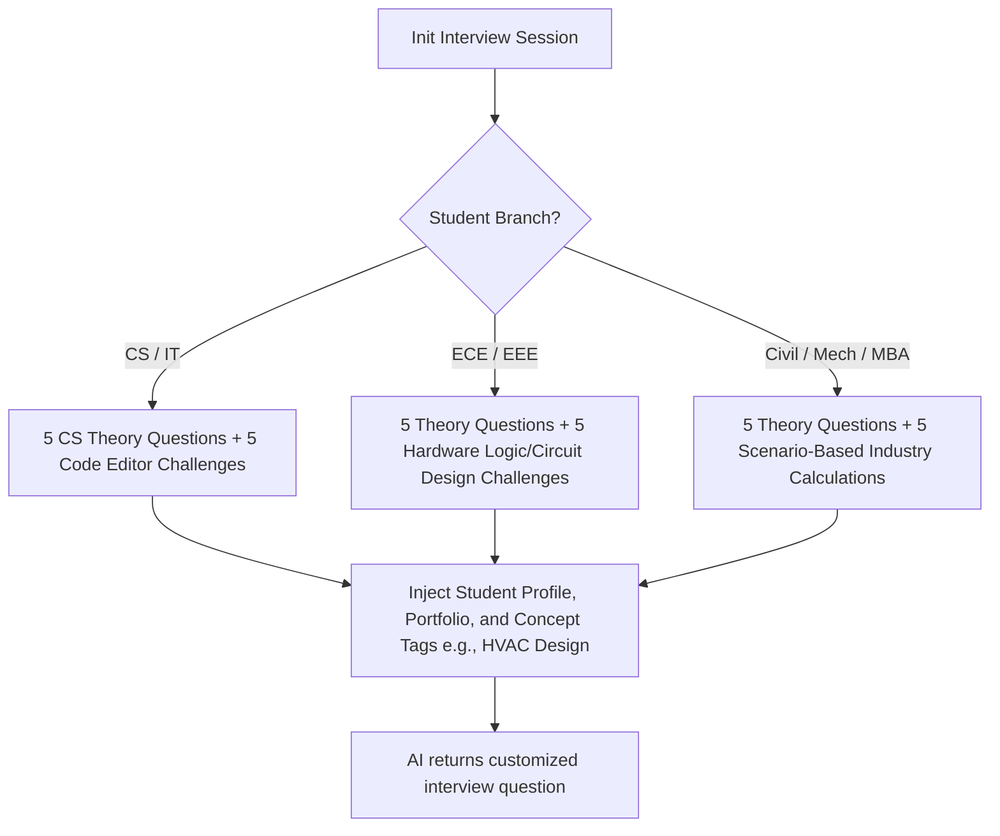

# Lakshya Placement Portal — Master Reference Manual & Technical Specification

This master reference manual provides an exhaustive specification of every module, user role, controller, backend service, and data pipeline within the Lakshya Placement Portal.

---

## 1. System Architecture & Component Mapping

Lakshya utilizes a multi-tier decoupled monolith architecture written in **PHP 8.x** and **Vanilla Javascript (ES6)**. It utilizes **MySQL (PDO)** as the local application database and interfaces with remote ERP systems at **GMU** and **GMIT** via local proxy mapping.

```
Lakshya/
│
├── config/
│   └── bootstrap.php               # Core setup, autoloader, session initialization, PDO DB connections, global auth helpers.
│
├── src/
│   ├── Models/
│   │   ├── Model.php               # Base Active Record ORM abstract class.
│   │   ├── User.php                # Platform roles, auth states, session variables.
│   │   ├── StudentProfile.php      # Resolves GMU/GMIT student ERP profiles, academic history, branch equivalents.
│   │   ├── Portfolio.php           # Skills, projects, and certifications registered by students.
│   │   ├── JobPosting.php          # Open job posts, eligibility criteria, branches, backlogs.
│   │   ├── InternshipPosting.php   # Internship listings and requirements.
│   │   ├── JobApplication.php      # Connects students to job postings; tracks application status.
│   │   ├── InternshipApplication.php # Connects students to internship postings.
│   │   ├── PlacementOfficer.php    # Account model for placement officers.
│   │   └── CareerRoadmap.php       # AI-generated educational roadmaps for students.
│   │
│   ├── Services/
│   │   ├── AIService.php           # Prompt engine connecting to OpenAI API (Mock interviews, ATS, hints).
│   │   ├── QueueService.php        # SQLite/DB backed asynchronous background job queue.
│   │   ├── StudentIntelligenceService.php # Computes student academic strengths, placement probability, skill gaps.
│   │   └── ResumeScoringEngine.php # Rule-based scoring matrices for resume parsing.
│   │
│   └── Helpers/
│       └── SessionFilterHelper.php  # Caches and clears search/filter variables.
│
└── public/
    ├── login.php                   # Unified login gateway for students, coordinators, and admins.
    │
    ├── student/                    # --- Student Module ---
    │   ├── dashboard.php           # Personalized student workspace.
    │   ├── coding_practice.php     # Practice problem library.
    │   ├── coding_problem.php      # Code editor sandbox with CodeMirror and AI Coach.
    │   ├── mock_ai_interview.php   # Technical, HR, and Aptitude interview simulator.
    │   ├── resume_analyzer.php     # ATS resume parsing and scoring system.
    │   ├── resume_builder.php      # Form-based resume editor.
    │   ├── resume_generator.php    # Live PDF template engine.
    │   ├── feedback.php            # Direct communication channel with placement coordinators.
    │   └── sso_redirect.php        # SSO router to access the external AI Tutor.
    │
    ├── coordinator/                # --- Coordinator Module ---
    │   ├── dashboard.php           # Student engagement metrics.
    │   ├── assign_task.php         # Coordinator task designer (Aptitude, Tech, HR).
    │   └── student_feedbacks.php   # Reads student reports and replies.
    │
    ├── officer/                    # --- Placement Officer Module ---
    │   ├── dashboard.php           # Job application tracking charts.
    │   ├── jobs.php                # Job post manager.
    │   └── applications.php        # Excel/PDF exporter for job applicants.
    │
    ├── hod/                        # --- HOD Module ---
    │   └── dashboard.php           # Department-level stats and engagement ratios.
    │
    ├── vc/                         # --- VC Module ---
    │   └── dashboard.php           # Executive-level placement reports.
    │
    └── admin/                      # --- Admin Module ---
        ├── logs.php                # System activity tracker.
        ├── audit_logs.php          # AI transaction monitor (token counts, latency).
        └── reported_questions.php  # Question key corrector console.
```

---

## 2. Comprehensive Module & Feature Walkthrough

### 👤 1. Student Module
* **Smart Dashboard (`dashboard.php`)**: Dynamically aggregates:
  - **Assigned Tasks**: Chronological timeline of exams (Aptitude, Tech, HR) pushed by coordinators with countdown alerts for deadlines.
  - **Academic Progress**: Visual SGPA charts and backlog alerts.
  - **Job Openings**: Real-time matching list showing jobs where the student meets branches, CGPA, and backlog thresholds.
* **Resume Builder & ATS Analyzer (`resume_analyzer.php`, `resume_builder.php`)**:
  - **Resume Builder**: Multi-step builder collecting Education, Projects, Internships, Skills, and Achievements. Writes to `student_resumes` table.
  - **Resume Generator**: Generates clean, ATS-compliant single-page A4 PDFs in the browser.
  - **ATS Scan**: Student uploads a PDF. `BasicPdfParser` extracts text. `ResumeScoringEngine` runs scoring rules. `AIService::advancedATSAnalysis` performs matching against target job profiles, generating score deductions, red flags, keyword gaps, and bullet-point rewrites.
* **Coding Practice Sandbox (`coding_problem.php`, `coding_practice.php`)**:
  - **Editor IDE**: Integrated **CodeMirror 5.x** with syntax highlighting, autocomplete, and language selector (**C, C++, Java, JS, Python**).
  - **Dual Mode**:
    - *Learning Mode*: Pre-compiles assertions inside a hidden wrapper so students only implement the logic function.
    - *Competitive Mode*: Simulates standard competitive coding where code reads from `stdin` and writes to `stdout`.
  - **AI Coach (Progressive Hint Engine)**: Uses `AIService::getMentorFeedback` to guide students using a **1 to 6 hint progression** based on their active code:
    1. *Logic Overview*: Explains the algorithm conceptually.
    2. *Parameter Check*: Warns of edge cases (empty lists, negative values).
    3. *Code Structure*: Provides skeleton structure.
    4. *Bridge Guidance*: Explains why syntax/logic diverges from the goal.
    5. *Specific Line Fix*: Pinpoints exact buggy lines.
    6. *Partial Snippet*: Corrects a 2-3 line block.
* **Mock AI Interview Simulator (`mock_ai_interview.php`)**:
  - **Interactive Viva**: Real-time technical, HR, or aptitude rounds. Uses browser Web Speech API for voice responses.
  - **Branch-Adaptive Prompting**: Evaluates answers dynamically. For CS/IT students, the AI asks coding questions. For ECE/EEE, it asks low-level logic/circuit design questions. For Civil/Mechanical/MBA, it focuses on calculations and scenarios.
  - **Performance Evaluation**: Provides a detailed report with overall scores, sectional ratings, transcript highlights, and expert recommendations.

---

### 👥 2. Coordinator Module
* **Task Assigner (`assign_task.php`)**:
  - **Student Directory Grid**: Searches and filters students across GMU and GMIT by branch, semester, SGPA range, and backlog flags.
  - **Target Concept Customizer**: Assigns specialized technical tasks (e.g. *Taxation, HVAC Design*) to tailor interview prompts for non-CS branches.
  - **Bulk Actions**: Selects all filtered students to schedule mock tasks in one action.
* **Student Feedbacks Console (`student_feedbacks.php`)**:
  - Monitors messages, reports, and incorrect question submissions sent by students. Provides a rich communication portal to reply directly.

---

### 💼 3. Placement Officer Module
* **Job Board (`jobs.php`)**:
  - Publish jobs specifying required skills, branches, CGPA, graduation year, and allowed backlogs.
* **Applicant Manager (`applications.php`)**:
  - View students who applied for a specific job.
  - **Export System**: Dynamic generation of Excel sheets (`.xlsx` via PhpSpreadsheet) and PDF reports matching the officer's currently active filters.

---

### ⚙️ 4. Admin Module
* **AI Audit Console (`audit_logs.php`)**:
  - Tracks OpenAI API latency, model type, input/output tokens, and costs.
* **Reported Questions Console (`reported_questions.php`)**:
  - Lists question evaluations disputed by students. Admin can trigger `AIService::autoFixReportedQuestion`, which runs an automated prompt to inspect, fix, and update correct options or test cases in the local database.

---

## 3. Database Schema Blueprint (Exhaustive Column Specification)

```sql
-- Core user accounts
CREATE TABLE `users` (
  `id` INT AUTO_INCREMENT PRIMARY KEY,
  `username` VARCHAR(255) NOT NULL UNIQUE,
  `password_hash` VARCHAR(255) NOT NULL,
  `role` VARCHAR(50) NOT NULL, -- Student, Coordinator, Admin, Officer
  `institution` VARCHAR(10) NOT NULL, -- GMU, GMIT
  `aadhar` VARCHAR(20) DEFAULT NULL,
  `created_at` TIMESTAMP DEFAULT CURRENT_TIMESTAMP
);

-- Coordinator task definitions
CREATE TABLE `coordinator_tasks` (
  `id` INT AUTO_INCREMENT PRIMARY KEY,
  `coordinator_id` INT NOT NULL,
  `task_type` VARCHAR(50) NOT NULL, -- aptitude, technical, hr
  `company_name` VARCHAR(255) DEFAULT NULL,
  `technical_topics` VARCHAR(255) DEFAULT NULL, -- e.g., HVAC Design, Taxation
  `question_source` VARCHAR(50) NOT NULL, -- ai, manual
  `deadline` DATETIME NOT NULL,
  `target_students` JSON NOT NULL, -- Array of USNs
  `created_at` TIMESTAMP DEFAULT CURRENT_TIMESTAMP,
  FOREIGN KEY (`coordinator_id`) REFERENCES `users`(`id`)
);

-- Student task submissions
CREATE TABLE `task_completions` (
  `id` INT AUTO_INCREMENT PRIMARY KEY,
  `task_id` INT NOT NULL,
  `student_id` VARCHAR(255) NOT NULL, -- Student USN/Aadhar
  `score` DECIMAL(5,2) DEFAULT NULL,
  `completed_at` DATETIME DEFAULT NULL,
  FOREIGN KEY (`task_id`) REFERENCES `coordinator_tasks`(`id`)
);

-- Coding problem definition library
CREATE TABLE `coding_problems` (
  `id` INT AUTO_INCREMENT PRIMARY KEY,
  `title` VARCHAR(255) NOT NULL,
  `statement` TEXT NOT NULL,
  `difficulty` VARCHAR(50) NOT NULL, -- Easy, Medium, Hard
  `category` VARCHAR(100) NOT NULL, -- Arrays, Strings, Loops, DP
  `test_cases` JSON NOT NULL, -- Assert inputs and expected outputs
  `example_input` TEXT DEFAULT NULL,
  `example_output` TEXT DEFAULT NULL,
  `solution_beginner` JSON DEFAULT NULL,
  `solution_optimized` JSON DEFAULT NULL
);

-- Coding sandbox progress tracker
CREATE TABLE `student_coding_progress` (
  `id` INT AUTO_INCREMENT PRIMARY KEY,
  `student_id` VARCHAR(255) NOT NULL,
  `institution` VARCHAR(10) NOT NULL,
  `problem_id` INT NOT NULL,
  `status` VARCHAR(50) NOT NULL DEFAULT 'attempted', -- attempted, solved, mastered
  `attempts` INT NOT NULL DEFAULT 1,
  `code_submitted` TEXT DEFAULT NULL,
  `language_used` VARCHAR(50) DEFAULT NULL,
  `last_attempt_date` TIMESTAMP DEFAULT CURRENT_TIMESTAMP ON UPDATE CURRENT_TIMESTAMP,
  FOREIGN KEY (`problem_id`) REFERENCES `coding_problems`(`id`)
);

-- OpenAI API transaction logging
CREATE TABLE `ai_audit_logs` (
  `id` INT AUTO_INCREMENT PRIMARY KEY,
  `user_id` INT NOT NULL,
  `service_method` VARCHAR(255) NOT NULL,
  `model` VARCHAR(100) NOT NULL,
  `tokens_used` INT NOT NULL,
  `cost` DECIMAL(10,6) NOT NULL,
  `latency_ms` INT NOT NULL,
  `created_at` TIMESTAMP DEFAULT CURRENT_TIMESTAMP
);
```

---

## 4. SSO Identity Resolution & ERP Mapping Logic

Since student registration states reside in external databases, `StudentProfile::getByUserId` translates queries into a unified profile mapping:

1. **For GMU**: Queries remote table `ad_student_approved` by USN or Aadhar fallback to retrieve enrollment, discipline, and current SGPA.
2. **For GMIT**: Queries remote table `ad_student_details`. Because GMIT ERP does not store semester snapshots directly in the remote table, Lakshya retrieves current semester and SGPA records from the local `student_sem_sgpa` table, mapping them into the student's active session profile.

---

## 5. Mock Interview Adaptive Question Pipeline

The platform uses `AIService::getTechnicalInterviewResponse` to generate customized interview flows based on the student's branch and coordinator instructions.


* **Pass-to-Proceed Mechanism**: During coding challenges in the CS technical round, the AI evaluation must return `PASSED` before the student is allowed to proceed to the next question.
* **Topic Rotation**: Prompts enforce a balanced rotation across technical domains (Databases, OOP, Networks, OS, DSA) based on a session-specific random seed.
